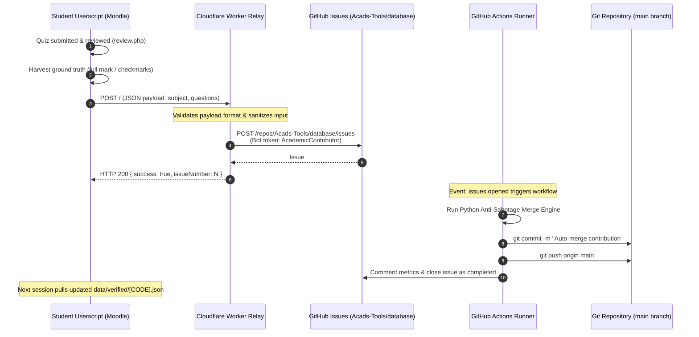

# Community Pipeline & Cloud Architecture

This document describes the end-to-end serverless pipeline that powers the community-driven verified answer database for **AMAES Moodle Toolkit**.

---

## 1. System Architecture Overview

The system uses a completely serverless, zero-maintenance architecture combining **Cloudflare Workers**, **GitHub Issues**, and **GitHub Actions**:

---

## 2. Component Details

### A. Client-Side Contribution Dispatcher
- **Location**: [`amaes-toolkit.user.js`](file:///home/ryme/Personal/amaes-moodle-toolkit/amaes-toolkit.user.js) (`dispatchCommunityContribution`)
- **Privacy First**: Strips all user identifiers, Moodle session cookies, student numbers, and names. Only the subject code and sanitized question/answer pairs are sent.
- **Opt-Out**: Can be toggled off at any time under the **Study Database** tab (*"Collect & Share Anonymously"*).

### B. Cloudflare Serverless Worker Relay
- **Endpoint**: `https://amaes-community-relay.acads-tools.workers.dev`
- **Source Code**: [`relay/worker.js`](file:///home/ryme/Personal/database/relay/worker.js)
- **Role**: Serves as a secure API gateway between client browsers and GitHub.
- **Security & Rate Limiting**:
  - Validates `subjectCode` against format regex (`/^[A-Z0-9_-]{2,16}$/`).
  - Disallows empty or non-array question payloads.
  - Keeps the GitHub Bot Personal Access Token securely stored in Cloudflare environment secrets (`GITHUB_BOT_TOKEN`).
- **Issue Creation**: Opens an issue titled `[Contribution] Auto-Sync for [SUBCODE] ([N] verified answers)` with labels:
  - `community-contribution`
  - `automated-sync`

### C. GitHub Actions Automation
- **Workflow File**: `.github/workflows/auto-merge-contributions.yml`
- **Trigger**: Fired automatically on `issues: types: [opened]` when labels contain `community-contribution`.
- **Permissions**: Scoped strictly to `contents: write` and `issues: write`.
- **Concurrency**: Governed by concurrency group `community-database-merge` to prevent race conditions during simultaneous student submissions.

### D. Python Anti-Sabotage Merge Engine
- **Engine Script**: `scripts/merge_contributions.py`
- **Responsibilities**:
  1. **HTML/XSS Sanitization**: Strips HTML tags, `javascript:`, and protocol injection vectors.
  2. **Question Key Normalization**: Fuzzy keying removes punctuation, whitespace variants, and casing to deduplicate questions.
  3. **Consensus & Verification**:
     - Updates question confirmation counters.
     - Detects and isolates conflicting answers.
     - Purges confirmed wrong distractors from choice pools.
  4. **Multi-File Persistence**:
     - Writes to `data/[SUBCODE].json` (unified archive).
     - Writes to `data/community/[SUBCODE].json` (raw community pool).
     - Writes to `data/verified/[SUBCODE].json` (high-consensus verified pool).
     - Dynamically updates the statistics table in `README.md`.

### E. Post-Merge Issue Lifecycle
- The runner commits changes directly to `main` with `[skip ci]`.
- Posts an informative comment on the issue with merge metrics:
  - Subject code
  - New questions added
  - Existing confirmations updated
  - Total verified questions in subject file
- Automatically marks the issue as `closed` with reason `completed`.

---

## 3. Privacy & Identity Governance

All automated commits and changes across the repositories strictly adhere to the project identity rules:

| Attribute | Mandatory Value |
| :--- | :--- |
| **Git Author Name** | `AcademicContributor` |
| **Git Author Email** | `academic-contributor@users.noreply.github.com` |
| **Committer Name** | `AcademicContributor` |
| **Committer Email** | `academic-contributor@users.noreply.github.com` |

- **Local Git Hooks**: Enforced by an executable `.git/hooks/pre-commit` hook that blocks any commit where `user.name` or `user.email` deviates from the above identity.
- **Workflow Automation**: GitHub Actions explicitly configures `git config user.name "AcademicContributor"` and `git config user.email "academic-contributor@users.noreply.github.com"`.
- **Zero Personal Linkage**: No personal usernames, emails, or personal accounts are ever attached to commits, issues, or releases.

---

## 4. Client Sync Flow

When a student opens a subject in Moodle:
1. The userscript requests the raw verified JSON endpoint from GitHub Pages or the raw repository:
   `https://raw.githubusercontent.com/Acads-Tools/database/main/data/verified/[SUBCODE].json`
2. Received questions are merged into the student's local `localStorage` cache.
3. The merge preserves existing local review data while adopting newly verified questions from peers.
